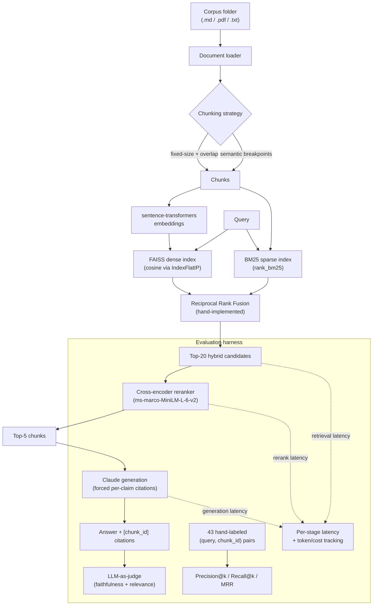

# hybridrag

A hybrid (dense + sparse) retrieval-augmented generation pipeline with a
rigorous evaluation and ablation harness, built to be defensible in a
technical interview — every architectural choice is measured against
alternatives, not assumed. See [DESIGN_DECISIONS.md](DESIGN_DECISIONS.md)
for the reasoning behind each major choice, including alternatives
considered and why they lost.

> **Status**: all 6 build phases complete against a sample DSA-notes
> corpus. Swap in a real corpus by pointing `ingest()` at a different
> folder — nothing else changes (see "Using your own corpus" below).

## Architecture



Retrieval mode (`dense` vs `hybrid`) and reranking (`on`/`off`) are both
config switches on the same pipeline, not separate code paths — that's what
lets the ablation study in Phase 5 compare all three configs by changing
two config values.

## Ablation results

The single most important artifact in this project. Full eval set (43
hand-labeled queries) run through three configurations, varying only
`RetrievalConfig.mode` and `RerankerConfig.enabled`:

| Config | P@1 | P@3 | R@3 | R@5 | MRR | Retrieval latency |
|---|---|---|---|---|---|---|
| (a) dense-only | 0.698 | 0.318 | 0.953 | 0.977 | 0.824 | 8.2ms |
| (b) dense + BM25 (RRF) | 0.767 | 0.333 | 1.000 | 1.000 | 0.880 | 6.0ms |
| (c) dense + BM25 + reranker | 0.907 | 0.333 | 1.000 | 1.000 | 0.946 | 312.3ms |

**What each component earned, and what it cost:**

- **+ BM25 (a → b)**: MRR +0.056, P@1 +0.070, retrieval latency **±0ms**
  (RRF fusion overhead is negligible; hybrid retrieval is not slower than
  dense-only here). This is close to a free win: BM25 fixes exact-term
  misses dense embeddings blur past (e.g. acronyms — see
  [DESIGN_DECISIONS.md](DESIGN_DECISIONS.md#hybrid-retrieval-rrf-fusion))
  without adding meaningful latency.
- **+ Reranker (b → c)**: MRR +0.066, P@1 +0.140, retrieval latency
  **+306ms**. This is the single largest accuracy jump of the three
  components, but it is not free — reranking is ~98% of total
  retrieval-path latency on this corpus. Worth it for an interactive
  Q&A tool where 300ms is invisible; not obviously worth it for a
  latency-sensitive path (e.g. autocomplete).
- **Total (a → c)**: MRR +0.122, P@1 +0.209, retrieval latency +304ms.

Generation quality (LLM-as-judge faithfulness/relevance) and token-cost
comparison across configs are wired up (`run_ablation.py --with-generation`)
but require `ANTHROPIC_API_KEY`; not run for this table. Rerun with a key
set to fill in that half of the picture.

Raw per-config numbers: `data/eval/results/ablation_results.json`
(regenerated by `run_ablation.py`, not committed — it's a derived
artifact, not a source of truth).

## Quickstart

```bash
python3.12 -m venv .venv
source .venv/bin/activate
pip install -e ".[dev]"

pytest                        # 72 tests, no API key needed

export ANTHROPIC_API_KEY=sk-ant-...   # only needed for generation/judging
python scripts/demo_phase1.py         # dense-only baseline
python scripts/demo_phase2.py         # dense vs BM25 vs hybrid, side by side
python scripts/demo_phase3.py         # reranking + real latency numbers
python scripts/demo_phase4.py         # eval harness against current config
python scripts/run_ablation.py        # the full 3-config comparison table
```

## Using your own corpus

Drop `.md` / `.pdf` / `.txt` files into a folder and point any script's
`CORPUS_DIR` at it, or call directly:

```python
from hybridrag.config import PipelineConfig
from hybridrag.pipeline import RagPipeline

pipeline = RagPipeline(PipelineConfig())
pipeline.ingest("/path/to/your/corpus")
pipeline.answer("your question")
```

The hand-labeled eval set in `data/eval/labels.json` is specific to the
sample corpus's chunk boundaries under the default fixed-chunking config
(`chunk_size=220`, `overlap=40` words) — swapping corpora means
re-labeling a new set of `(query, chunk_id)` pairs against the new chunk
IDs. To see the new boundaries before labeling:

```python
from hybridrag.ingestion.loaders import load_corpus
from hybridrag.ingestion.chunking import chunk_fixed_size

chunks = chunk_fixed_size(load_corpus("data/your_corpus"), chunk_size=220, overlap=40)
for c in chunks:
    print(c.chunk_id, "\n", c.text, "\n")
```

## Repository structure

```
src/hybridrag/
  types.py                 # Document, Chunk, ScoredChunk, GenerationResult - core data model
  config.py                 # PipelineConfig and all per-stage sub-configs
  pipeline.py                # RagPipeline: ingest -> retrieve -> generate orchestration
  embeddings.py               # sentence-transformers wrapper
  ingestion/
    loaders.py                # .md / .pdf / .txt -> Document
    chunking.py                # fixed-size and semantic chunking strategies
  retrieval/
    dense.py                    # FAISS IndexFlatIP wrapper
    sparse.py                    # BM25 wrapper (rank_bm25)
    fusion.py                     # hand-implemented Reciprocal Rank Fusion
    hybrid.py                      # HybridRetriever: dense + sparse + RRF
    reranker.py                     # cross-encoder reranking stage
  generation/
    generator.py                     # Claude call with citation-forcing prompt
  eval/
    types.py                          # EvalExample, RetrievalScore, JudgeScore, EvalReport
    labels.py                          # loads data/eval/labels.json
    retrieval_metrics.py                # Precision@k, Recall@k, MRR
    judge.py                             # Claude LLM-as-judge (faithfulness + relevance)
    harness.py                            # runs a pipeline over the labeled set, aggregates

data/
  sample_corpus/    # 4 hand-written DSA-notes markdown files
  eval/labels.json   # 43 hand-labeled (query, chunk_id) pairs

scripts/
  demo_phase1.py .. demo_phase4.py   # incremental, phase-by-phase demos
  run_ablation.py                     # the Phase 5 comparison table

tests/    # 72 tests across chunking, loading, all 3 retrieval stages,
          # fusion, reranking, retrieval metrics, judge, and the harness
```

## Design decisions

Every non-obvious choice (chunking strategy, fusion method, reranker model,
judge prompt design, embedding model, index type, and more) is written up
with alternatives considered in [DESIGN_DECISIONS.md](DESIGN_DECISIONS.md).
